# Multimodal Room Monitor

An advanced, open-source multimodal perception system that synchronizes video frames with audio to perform real-time object detection, tracking, segmentation, audio classification, and cross-modal fusion. The system combines state-of-the-art computer vision and audio processing models with a lightweight transformer-based fusion architecture to provide comprehensive room monitoring capabilities.

## 📋 Table of Contents

- [Overview](#overview)
- [Key Features](#key-features)
- [Architecture & Dataflow](#architecture--dataflow)
- [Project Structure](#project-structure)
- [Libraries & Dependencies](#libraries--dependencies)
- [Key Innovations](#key-innovations)
- [Use Cases](#use-cases)
- [Installation](#installation)
- [Usage](#usage)
- [Configuration](#configuration)
- [Flowcharts](#flowcharts)
- [Technical Details](#technical-details)
- [License](#license)

---

## 🎯 Overview

The Multimodal Room Monitor is a sophisticated system that captures synchronized video and audio data, processes them through multiple AI models, and fuses the information to provide intelligent insights about room activity. It's designed to be fast, efficient, and runnable on standard laptops while leveraging cutting-edge deep learning models.

### Core Capabilities

- **Vision Processing**: Real-time object detection, multi-object tracking, instance segmentation, and optical flow analysis
- **Audio Processing**: Audio classification using transformer models, spectral analysis (STFT, CWT, Mel-spectrograms), and feature extraction
- **Multimodal Fusion**: Cross-modal transformer architecture that combines visual and audio features for activity recognition
- **Interactive UI**: Streamlit-based web interface with real-time visualization and detailed analysis reports

---

## ✨ Key Features

### Vision Pipeline
- **YOLO Detection**: Ultralytics YOLOv8 for fast, accurate object detection
- **ByteTrack Tracking**: Multi-object tracking with persistent IDs across frames
- **Segmentation**: Configurable segmentation models (MobileSAM/FastSAM support)
- **Optical Flow**: TV-L1 optical flow for motion vector computation
- **Wavelet Analysis**: Multi-resolution texture analysis using PyWavelets

### Audio Pipeline
- **AST Classification**: Audio Spectrogram Transformer from HuggingFace for audio scene classification
- **Spectral Features**: Mel-spectrograms, CWT scalograms, STFT analysis
- **DSP Features**: Zero-crossing rate, spectral centroid, bandwidth, rolloff
- **Real-time Processing**: Live audio stream analysis with callback-based capture

### Fusion Architecture
- **Cross-Modal Transformer**: Lightweight transformer encoder for temporal feature fusion
- **Temporal Alignment**: Audio-to-frame synchronization for accurate multimodal analysis
- **Activity Recognition**: Binary classification (static vs. moving activity)

### User Interface
- **Streamlit Dashboard**: Interactive web interface with live preview
- **Visual Overlays**: Bounding boxes, track IDs, optical flow arrows, segmentation masks
- **Audio Visualizations**: Spectrograms, scalograms, and classification results
- **Real-time Monitoring**: Live capture mode with continuous analysis

---

## 🏗️ Architecture & Dataflow

### High-Level Architecture

```
┌─────────────────────────────────────────────────────────────────┐
│                         SENSOR LAYER                            │
│  ┌──────────────┐                    ┌──────────────┐          │
│  │   Camera     │                    │  Microphone │          │
│  │  (10 frames) │                    │  (~2 sec)    │          │
│  └──────┬───────┘                    └──────┬───────┘          │
│         │                                    │                  │
└─────────┼────────────────────────────────────┼──────────────────┘
          │                                    │
          ▼                                    ▼
┌─────────────────────────────────────────────────────────────────┐
│                      PREPROCESSING LAYER                        │
│  ┌──────────────┐                    ┌──────────────┐          │
│  │ Image        │                    │ Audio        │          │
│  │ - Denoising  │                    │ - STFT       │          │
│  │ - Grayscale  │                    │ - Mel-spec   │          │
│  │ - Wavelets   │                    │ - CWT        │          │
│  │ - Flow       │                    │ - Features   │          │
│  └──────┬───────┘                    └──────┬───────┘          │
└─────────┼────────────────────────────────────┼──────────────────┘
          │                                    │
          ▼                                    ▼
┌─────────────────────────────────────────────────────────────────┐
│                        MODEL LAYER                              │
│  ┌──────────────┐  ┌──────────┐  ┌──────────┐  ┌──────────┐   │
│  │  Detector    │  │ Tracker  │  │Segmenter │  │  Audio   │   │
│  │  (YOLOv8)    │→ │(ByteTrack│→ │(MobileSAM│  │  (AST)   │   │
│  └──────────────┘  └──────────┘  └──────────┘  └────┬─────┘   │
└──────────────────────────────────────────────────────┼──────────┘
                                                       │
          ┌────────────────────────────────────────────┘
          │
          ▼
┌─────────────────────────────────────────────────────────────────┐
│                      FUSION LAYER                               │
│  ┌──────────────────────────────────────────────────────────┐  │
│  │     Cross-Modal Transformer Encoder                      │  │
│  │  ┌──────────┐  ┌──────────┐  ┌──────────┐              │  │
│  │  │  Visual  │  │  Audio   │  │ Temporal │              │  │
│  │  │  Tokens  │+ │  Tokens  │→ │  Fusion  │              │  │
│  │  └──────────┘  └──────────┘  └──────────┘              │  │
│  └──────────────────────────────────────────────────────────┘  │
└─────────────────────────────────────────────────────────────────┘
          │
          ▼
┌─────────────────────────────────────────────────────────────────┐
│                      VISUALIZATION LAYER                        │
│  ┌──────────────┐                    ┌──────────────┐          │
│  │  Streamlit   │                    │  Analysis    │          │
│  │  Dashboard   │                    │  Reports     │          │
│  └──────────────┘                    └──────────────┘          │
└─────────────────────────────────────────────────────────────────┘
```

### Detailed Dataflow

1. **Data Capture Phase**
   - Camera captures 10 frames at ~20 FPS (configurable interval)
   - Microphone records ~2 seconds of audio at 16kHz
   - Timestamps are recorded for synchronization

2. **Preprocessing Phase**
   - **Images**: Denoising → Grayscale conversion → Wavelet decomposition → Optical flow computation
   - **Audio**: STFT → Mel-spectrogram → CWT scalogram → Spectral feature extraction

3. **Model Inference Phase**
   - **Vision**: Detection → Tracking → Segmentation (per frame)
   - **Audio**: AST model inference → Top-k classification → Feature embedding

4. **Feature Extraction Phase**
   - **Visual Tokens**: [bbox_count, mean_confidence, wavelet_energy, ...]
   - **Audio Tokens**: [ZCR, spectral_centroid, bandwidth, rolloff, ...]
   - Temporal alignment of audio windows to video frames

5. **Fusion Phase**
   - Project visual and audio tokens to common dimension
   - Early fusion via residual addition
   - Transformer encoder processes temporal sequence
   - Classification head outputs activity probability

6. **Visualization Phase**
   - Overlay bounding boxes, track IDs, flow arrows on frames
   - Display spectrograms, scalograms, classification results
   - Show fusion probabilities and per-frame summaries

---

## 📁 Project Structure

```
working-0/
│
├── configs/
│   └── config.yaml              # Main configuration file
│
├── models/
│   ├── __init__.py
│   ├── detector.py              # YOLO-based object detector
│   ├── tracker.py               # ByteTrack multi-object tracker
│   ├── segmenter.py             # Segmentation model wrapper
│   ├── audio_model.py           # AST audio classifier
│   └── fusion.py                # Cross-modal transformer fusion
│
├── preprocess/
│   ├── __init__.py
│   ├── image.py                 # Image preprocessing (denoising, flow, wavelets)
│   └── audio.py                 # Audio preprocessing (STFT, CWT, features)
│
├── sensors/
│   ├── __init__.py
│   ├── camera.py                # Camera capture utilities
│   └── mic.py                   # Microphone recording utilities
│
├── ui/
│   └── app.py                   # Streamlit web application
│
├── utils/
│   ├── __init__.py
│   ├── config.py                # Configuration loader
│   └── sync.py                  # Audio-frame synchronization
│
├── requirements.txt              # Python dependencies
├── README.md                     # This file
└── yolov8n.pt                    # YOLO model weights (downloaded automatically)
```

### File Descriptions

#### Configuration
- **`configs/config.yaml`**: Central configuration file containing:
  - Device settings (CPU/CUDA/auto)
  - Burst capture parameters (frame count, interval)
  - Audio settings (sample rate, duration, channels)
  - Vision model parameters (detector, thresholds, tracker)
  - Audio model settings (HuggingFace model ID)
  - Fusion architecture parameters
  - UI theme and layout settings

#### Models
- **`models/detector.py`**: `FastDetector` class wrapping Ultralytics YOLO
  - Handles object detection with configurable confidence/IoU thresholds
  - Supports class filtering
  - Returns bounding boxes with class IDs and confidence scores

- **`models/tracker.py`**: `ByteTrackWrapper` class for multi-object tracking
  - Uses Ultralytics built-in ByteTrack implementation
  - Maintains track IDs across frames
  - Returns tracked objects with persistent IDs

- **`models/segmenter.py`**: Segmentation model interface
  - Currently implements `DummyBoxMasker` (rectangle masks)
  - Designed for MobileSAM/FastSAM integration
  - Generates per-object segmentation masks

- **`models/audio_model.py`**: `AudioClassifierAST` class
  - Loads Audio Spectrogram Transformer from HuggingFace
  - Performs audio scene classification
  - Returns top-k predictions with probabilities

- **`models/fusion.py`**: `CrossModalTransformer` class
  - Lightweight transformer encoder architecture
  - Projects visual and audio features to common space
  - Performs temporal fusion and binary classification

#### Preprocessing
- **`preprocess/image.py`**: Image processing functions
  - `denoise_frame()`: Fast non-local means denoising
  - `compute_wavelet_energy()`: Multi-resolution texture analysis
  - `optical_flow_tvl1()`: TV-L1 optical flow computation
  - `draw_flow_arrows()`: Visualization of motion vectors

- **`preprocess/audio.py`**: Audio processing functions
  - `compute_stft()`: Short-Time Fourier Transform
  - `compute_mel_spectrogram()`: Mel-scale spectrogram
  - `compute_cwt_scalogram()`: Continuous Wavelet Transform
  - `spectral_features()`: Statistical audio features (ZCR, centroid, etc.)

#### Sensors
- **`sensors/camera.py`**: Camera interface
  - `list_cameras()`: Discovers available cameras
  - `capture_burst()`: Captures frame sequence with timestamps

- **`sensors/mic.py`**: Microphone interface
  - `list_microphones()`: Discovers available audio devices
  - `record_audio()`: Records audio with specified parameters

#### Utilities
- **`utils/config.py`**: Configuration management
  - `load_config()`: Loads YAML config with auto device detection

- **`utils/sync.py`**: Temporal synchronization
  - `align_audio_to_frames()`: Aligns audio windows to video frame timestamps

#### User Interface
- **`ui/app.py`**: Streamlit application
  - Device selection (camera/microphone)
  - Live capture mode with real-time preview
  - Burst capture mode for detailed analysis
  - Visualization of all processing results
  - Interactive controls and metrics display

---

## 📚 Libraries & Dependencies

### Core Deep Learning
- **`torch` (2.4.1)**: PyTorch for neural network operations
- **`torchvision` (0.19.1)**: Computer vision utilities
- **`torchaudio` (2.4.1)**: Audio processing utilities
- **`transformers` (4.45.2)**: HuggingFace transformers for AST model
- **`accelerate` (1.0.1)**: Model acceleration utilities

### Computer Vision
- **`ultralytics` (8.3.30)**: YOLOv8 detection and ByteTrack tracking
- **`opencv-contrib-python` (4.10.0.84)**: OpenCV with contrib modules (optical flow)
- **`scikit-image` (0.24.0)**: Image processing algorithms
- **`Pillow` (10.4.0)**: Image manipulation

### Audio Processing
- **`librosa` (0.10.2.post1)**: Audio analysis and feature extraction
- **`sounddevice` (0.4.7)**: Real-time audio I/O
- **`soundfile` (0.12.1)**: Audio file I/O
- **`pywavelets` (1.6.0)**: Wavelet transforms (for images and audio)

### Scientific Computing
- **`numpy` (>=1.26,<2.3)**: Numerical computing
- **`scipy` (1.13.1)**: Scientific computing (signal processing, statistics)
- **`scikit-learn` (1.5.2)**: Machine learning utilities

### UI & Visualization
- **`streamlit` (1.39.0)**: Web application framework
- **`matplotlib` (3.9.2)**: Plotting and visualization

### Utilities
- **`PyYAML` (6.0.2)**: YAML configuration parsing
- **`einops` (0.8.0)**: Tensor operations
- **`onnxruntime` (1.19.2)**: ONNX model inference (optional)

### Installation Notes
- All models are downloaded automatically on first run:
  - YOLOv8 weights from Ultralytics
  - AST model from HuggingFace
  - Segmentation models (if configured)
- CUDA support is automatic if available
- No external API keys required (fully open-source)

---

## 🚀 Key Innovations

### 1. **Synchronized Multimodal Capture**
- Precise temporal alignment between video frames and audio samples
- Timestamp-based synchronization ensures accurate cross-modal analysis
- Configurable burst capture with frame-level audio windowing

### 2. **Lightweight Cross-Modal Fusion**
- Efficient transformer architecture (2 layers, 4 heads, 128 hidden dim)
- Early fusion via residual addition before transformer encoding
- Temporal modeling across synchronized video-audio sequences

### 3. **Multi-Resolution Feature Extraction**
- **Vision**: Wavelet decomposition for texture analysis at multiple scales
- **Audio**: CWT scalograms for time-frequency analysis
- Combines deep learning features with classical DSP methods

### 4. **Real-time Processing Pipeline**
- Optimized for laptop-friendly inference
- Model caching via Streamlit's `@st.cache_resource`
- Live preview mode with continuous analysis
- Efficient batch processing for burst captures

### 5. **Comprehensive Audio Analysis**
- Multiple representation spaces: STFT, Mel-spectrogram, CWT
- Statistical features: ZCR, spectral centroid, bandwidth, rolloff
- Pre-trained transformer model for scene classification
- Top-k prediction with confidence scores

### 6. **Advanced Vision Processing**
- Multi-stage pipeline: Detection → Tracking → Segmentation
- Optical flow for motion analysis
- Wavelet energy for texture characterization
- Per-object temporal tracking with persistent IDs

### 7. **Flexible Architecture**
- Modular design allows easy model swapping
- Configuration-driven system (YAML-based)
- Support for multiple segmentation models (MobileSAM/FastSAM)
- Device-agnostic (CPU/CUDA auto-detection)

### 8. **Interactive Visualization**
- Real-time overlays: boxes, tracks, flow arrows
- Audio visualizations: spectrograms, scalograms
- Per-frame summaries and fusion probabilities
- Live capture mode with continuous updates

---

## 💼 Use Cases

### 1. **Smart Home Monitoring**
- Detect and track people/pets in rooms
- Classify audio events (door closing, footsteps, conversations)
- Identify activity patterns (moving vs. static)
- Privacy-preserving local processing

### 2. **Security & Surveillance**
- Real-time object detection and tracking
- Audio anomaly detection (glass breaking, alarms)
- Motion analysis via optical flow
- Activity logging with timestamps

### 3. **Healthcare Applications**
- Elderly care monitoring (fall detection, activity tracking)
- Patient room monitoring
- Audio-based health event detection (coughing, calling)
- Non-intrusive activity analysis

### 4. **Research & Development**
- Multimodal dataset collection
- Activity recognition research
- Cross-modal learning experiments
- Real-time AI system prototyping

### 5. **Educational Demonstrations**
- Computer vision and audio processing showcase
- Deep learning model integration examples
- Multimodal fusion techniques
- Real-time AI application development

### 6. **IoT Integration**
- Edge device deployment (with model optimization)
- Sensor fusion for smart environments
- Real-time decision making
- Local processing without cloud dependency

---

## 🔧 Installation

### Prerequisites
- Python 3.8 or higher
- Webcam and microphone (for live capture)
- CUDA-capable GPU (optional, for faster inference)

### Step-by-Step Installation

1. **Clone or navigate to the project directory**
   ```bash
   cd working-0
   ```

2. **Create a virtual environment**
   ```bash
   python -m venv venv
   ```

3. **Activate the virtual environment**
   
   **Windows (PowerShell):**
   ```powershell
   .\venv\Scripts\Activate.ps1
   ```
   
   **Windows (Command Prompt):**
   ```cmd
   venv\Scripts\activate.bat
   ```
   
   **Linux/Mac:**
   ```bash
   source venv/bin/activate
   ```

4. **Upgrade pip**
   ```bash
   pip install --upgrade pip
   ```

5. **Install dependencies**
   ```bash
   pip install -r requirements.txt
   ```

6. **Verify installation**
   ```bash
   python -c "import torch; import streamlit; print('Installation successful!')"
   ```

### First Run Setup
- Models will be downloaded automatically on first run:
  - YOLOv8 weights (~6MB)
  - AST model from HuggingFace (~50MB)
- Ensure stable internet connection for initial download
- Subsequent runs use cached models

---

## 🎮 Usage

### Starting the Application

1. **Activate the virtual environment** (if not already active)
   ```bash
   .\venv\Scripts\Activate.ps1  # Windows PowerShell
   ```

2. **Launch the Streamlit app**
   ```bash
   streamlit run ui/app.py
   ```

3. **Access the web interface**
   - The app will open automatically in your default browser
   - Default URL: `http://localhost:8501`

### Using the Interface

#### Device Selection
1. **Select Camera**: Choose from available camera indices
2. **Select Microphone**: Choose microphone device by index
3. Devices are auto-detected on startup

#### Capture Modes

##### **Burst Capture Mode** (Recommended for detailed analysis)
1. Click **"Capture Burst"** button
2. System captures:
   - 10 frames (configurable) at ~20 FPS
   - ~2 seconds of audio at 16kHz
3. Processing pipeline runs automatically:
   - Detection and tracking
   - Segmentation
   - Audio classification
   - Feature extraction
   - Multimodal fusion
4. Results displayed in organized sections:
   - **Video Analysis**: Frames with overlays
   - **Audio Analysis**: Spectrograms, classifications
   - **Fusion Result**: Activity probability
   - **Per-frame Summary**: Detailed statistics

##### **Live Capture Mode** (Real-time monitoring)
1. Adjust **"Live Capture Duration"** slider (2-10 seconds)
2. Adjust **"Frames to collect"** slider
3. Click **"Start Live Capture + Analysis"**
4. Real-time preview shows:
   - Live detections with bounding boxes
   - Live audio spectrogram
   - Frame count and detection statistics
5. After capture completes:
   - Full analysis runs automatically
   - Detailed results displayed

### Understanding the Output

#### Video Analysis Section
- **Bounding Boxes**: Red rectangles around detected objects
- **Track IDs**: Numbers above boxes (persistent across frames)
- **Flow Arrows**: Green arrows showing motion vectors
- **Frame Numbers**: Sequential frame identification

#### Audio Analysis Section
- **Top Audio Label**: Primary classification result with confidence
- **Mel-Spectrogram**: Time-frequency representation (magma colormap)
- **CWT Scalogram**: Wavelet-based time-scale representation (viridis colormap)
- **Top-5 Classes**: Ranked predictions with probabilities

#### Fusion Result
- **Activity Probability**: Binary classification (static vs. moving)
- **Progress Bar**: Visual representation of probability
- **Interpretation**: Higher values indicate more movement/activity

#### Per-frame Summary
- Detection counts per frame
- Track IDs present in each frame
- Useful for understanding temporal patterns

### Tips for Best Results

1. **Lighting**: Ensure adequate lighting for better detection
2. **Audio Quality**: Minimize background noise for accurate classification
3. **Camera Position**: Position camera to capture full scene
4. **Frame Rate**: Adjust frame interval for smoother tracking
5. **Model Selection**: Use faster models (YOLOv8n) for real-time, larger models for accuracy

---

## ⚙️ Configuration

### Configuration File: `configs/config.yaml`

#### Device Settings
```yaml
device: auto  # 'cuda' | 'cpu' | 'auto'
```
- `auto`: Automatically detects CUDA availability
- `cuda`: Force GPU usage (requires CUDA-capable GPU)
- `cpu`: Force CPU usage

#### Burst Capture Settings
```yaml
burst:
  num_frames: 10          # Number of frames to capture
  frame_interval_ms: 50    # Milliseconds between frames (~20 FPS)
```

#### Audio Settings
```yaml
audio:
  sample_rate: 16000       # Audio sample rate (Hz)
  duration_sec: 2.0        # Recording duration (seconds)
  channels: 1              # Mono (1) or Stereo (2)
```

#### Vision Model Settings
```yaml
vision:
  detector: yolov8n        # YOLO model: yolov8n, yolov8s, yolov8m, etc.
  conf_threshold: 0.3     # Detection confidence threshold
  iou_threshold: 0.5      # Intersection over Union threshold
  classes: null           # Filter classes (null = all, or list of COCO IDs)
  tracker: bytetrack      # Tracking algorithm
  segmentation_model: mobile_sam  # 'mobile_sam' | 'fast_sam'
  flow: tvl1              # Optical flow method
```

#### Audio Model Settings
```yaml
audio_model:
  hub_model: MIT/ast-finetuned-audioset-10-10-0.4593  # HuggingFace model ID
```

#### Fusion Architecture Settings
```yaml
fusion:
  hidden_dim: 128         # Transformer hidden dimension
  num_layers: 2           # Number of transformer layers
  num_heads: 4            # Number of attention heads
  dropout: 0.1            # Dropout rate
```

#### UI Settings
```yaml
ui:
  max_width: 1200         # Maximum UI width (pixels)
  theme: light           # 'light' | 'dark'
```

### Customization Examples

**Faster Processing (Lower Accuracy)**
```yaml
vision:
  detector: yolov8n
  conf_threshold: 0.5
burst:
  num_frames: 5
```

**Higher Accuracy (Slower Processing)**
```yaml
vision:
  detector: yolov8m
  conf_threshold: 0.25
burst:
  num_frames: 15
```

**Specific Object Detection**
```yaml
vision:
  classes: [0, 2, 5]  # Person, car, bus (COCO class IDs)
```

---

## 📊 Flowcharts

### System Overview Flowchart


### Vision Processing Pipeline


### Audio Processing Pipeline


### Fusion Architecture Flowchart

```mermaid
graph TD
    A[Visual Tokens<br/>B×T×V] --> C[Visual Projection<br/>Linear Layer]
    B[Audio Tokens<br/>B×T×A] --> D[Audio Projection<br/>Linear Layer]
    C --> E[Early Fusion<br/>Residual Addition]
    D --> E
    E --> F[Transformer Encoder<br/>2 Layers, 4 Heads]
    F --> G[Temporal Pooling<br/>Mean]
    G --> H[Classifier<br/>2 Classes]
    H --> I[Activity Probability]
```



### Data Synchronization Flowchart


### Model Loading Flowchart


### Real-time Processing Flowchart


---

## 🔬 Technical Details

### Model Specifications

#### YOLOv8 Detector
- **Architecture**: YOLOv8n (nano) - smallest variant
- **Input**: RGB images (640×640 default)
- **Output**: Bounding boxes, class IDs, confidence scores
- **Speed**: ~10-30 FPS on CPU, ~50-100 FPS on GPU
- **Classes**: 80 COCO classes

#### ByteTrack Tracker
- **Algorithm**: ByteTrack (association by detection)
- **Features**: 
  - Handles occlusions
  - Maintains IDs across frames
  - Low confidence detection recovery
- **Output**: Track IDs, bounding boxes, classes

#### Audio Spectrogram Transformer (AST)
- **Model**: MIT/ast-finetuned-audioset-10-10-0.4593
- **Architecture**: Vision Transformer adapted for audio
- **Input**: Mel-spectrogram patches
- **Output**: 527 AudioSet class probabilities
- **Parameters**: ~86M (tiny variant)

#### Cross-Modal Transformer Fusion
- **Architecture**: 
  - 2 transformer encoder layers
  - 4 attention heads
  - 128 hidden dimensions
  - 512 feedforward dimensions
- **Input**: 
  - Visual tokens: 8-dimensional (bbox count, confidence, wavelet energy, ...)
  - Audio tokens: 8-dimensional (ZCR, centroid, bandwidth, rolloff, ...)
- **Output**: Binary classification logits (static vs. moving)

### Feature Dimensions

#### Visual Features
- **Bounding Box Count**: Integer (number of detections)
- **Mean Confidence**: Float [0, 1]
- **Wavelet Energy**: Float (texture measure)
- **Reserved**: 5 additional dimensions for future features

#### Audio Features
- **Zero-Crossing Rate (ZCR)**: Float (temporal feature)
- **Spectral Centroid**: Float (frequency center of mass)
- **Spectral Bandwidth**: Float (frequency spread)
- **Spectral Rolloff**: Float (frequency cutoff)
- **Reserved**: 4 additional dimensions for future features

### Performance Characteristics

#### Processing Times (Approximate, CPU)
- Frame denoising: ~50-100ms per frame
- YOLO detection: ~100-200ms per frame
- ByteTrack tracking: ~10-20ms per frame
- Optical flow: ~200-500ms per frame pair
- Audio classification: ~200-300ms per 2s clip
- Fusion inference: ~5-10ms per sequence

#### Memory Usage
- Model loading: ~500MB-1GB (depending on models)
- Frame buffer: ~50-100MB (10 frames)
- Audio buffer: ~250KB (2s at 16kHz)
- Total: ~1-2GB typical usage

### Synchronization Algorithm

The `align_audio_to_frames` function implements a windowing approach:

1. For each frame timestamp `t_i`:
   - Calculate audio window: `[t_i - window/2, t_i + window/2]`
   - Extract corresponding audio samples
   - Pad if window extends beyond audio boundaries

2. Window size: `duration_sec / num_frames`

3. Ensures temporal alignment for fusion model

### Optical Flow Algorithm

- **Primary**: TV-L1 (Total Variation L1) optical flow
  - Dense flow field computation
  - Handles large displacements
  - Robust to illumination changes
- **Fallback**: Farneback optical flow
  - Used if TV-L1 unavailable
  - Polynomial expansion-based

### Wavelet Analysis

- **Wavelet**: Daubechies 2 (`db2`)
- **Decomposition Levels**: 2 levels
- **Energy Calculation**: Sum of squared detail coefficients
- **Purpose**: Multi-resolution texture characterization

---

## 📝 License

This project assembles open-source components. Please respect the licenses of:

- **Ultralytics YOLO**: AGPL-3.0
- **HuggingFace Transformers**: Apache 2.0
- **OpenCV**: Apache 2.0 / BSD
- **Librosa**: ISC
- **Streamlit**: Apache 2.0
- **PyTorch**: BSD-style

The project code itself is provided as-is for educational and research purposes. Please review individual component licenses before commercial use.

---

## 🤝 Contributing

This is a course project demonstrating multimodal AI system integration. For improvements:

1. Model integration (MobileSAM, FastSAM)
2. Additional audio features
3. Enhanced fusion architectures
4. Performance optimizations
5. Extended visualization capabilities

---

## 📧 Support

For issues or questions:
- Check configuration file settings
- Verify device compatibility
- Ensure all dependencies are installed
- Review model download logs

---

## 🎓 Acknowledgments

- **Ultralytics** for YOLOv8 and ByteTrack
- **HuggingFace** for transformer models and infrastructure
- **MIT** for Audio Spectrogram Transformer
- **OpenCV** community for computer vision tools
- **Streamlit** for rapid web app development

---

**Built with ❤️ for multimodal AI research and education**
